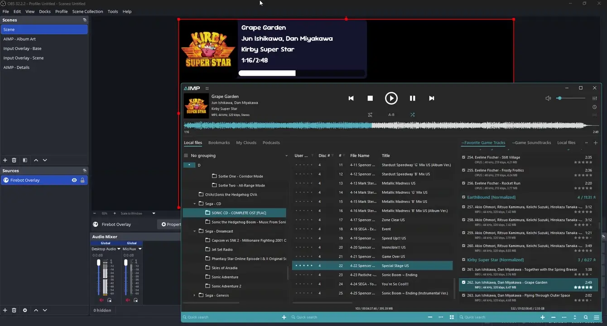

# AIMP for Firebot

This is a [Firebot](https://firebot.app) Plugin that allows Firebot to control AIMP and read live data about the currently playing track. Includes Overlay Widgets to show track details and cover art on stream.

### Prerequisite

Install the [Latest release of the Fluke Server AIMP Plugin](https://github.com/ReitanSora/fluke-server/releases/latest) by downloading the .aimppack file and opening it with AIMP. This Plugin uses that to communicate with AIMP.

### Setup

- In Firebot, go to Tools > Plugin Manager or Settings > Plugins & Scripts
  - Enable Plugins & Scripts if they are currently disabled
  - Click "Install From File"
  - Navigate to where you downloaded `oceanityAimp.js` and select that file
  - Confirm that you want to install the plugin
  - If you are running AIMP on a different PC than Firebot, change the AIMP Server Hostname to the IP Address of the PC AIMP is running on

### Updating

- Overwrite existing `oceanityAimp.js` with new version
- Restart Firebot
